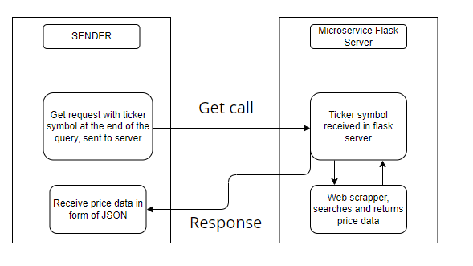

# Stock Price Finder!
## A microservice that sends stock price when receiving a ticker symbol.
### This microservice runs locally on a user's computer with Flask and by using a GET method.

Simply run the program in its own instance, and you will receive a server address of "http://127.0.0.1:5856"
Currently a port number of "5856" is being used, however, this can be changed to a user's preference.

To get the microservice onto a local computer:

```
git clone https://github.com/Raj-Lee-Code/CS361_Microservice.git
```

as well as needs the following packages installed: bs4, requests, and flask
you can install these as follows:

```
pip install flask
```
```
pip install bs4
```
```
pip install requests
```
To call the service from another program, make sure this microservice is running in the background and then use the following 
line in the get request: http://127.0.0.1:5856/ticker/?ticker="INSERT_TICKER_SYMBOL_HERE" replacing the text "INSERT TICKER SYMBOL HERE" to the desired stock ticker symbol

An example request line would be: 
```
http://127.0.0.1:5856/ticker/?ticker=MSFT 
```
The above returns the price of Microsoft as ticker symbol "MSFT" is given

The returned value from the microservice is in the form of a JSON as follows:
```
{
Price: "338.37"
}
```
If the price of a given ticker symbol is not found, the following is returned instead
```
{
Price: "Price not found. Please recheck ticker symbol."
}
```
Example python code that would send and receive data from the service may look something as below:
```
import requests
ticker = 'MSFT'
response = requests.get(f"http://127.0.0.1:5856/ticker/?ticker={ticker}")
data = response.json()
print(data['Price'])
```

# UML

